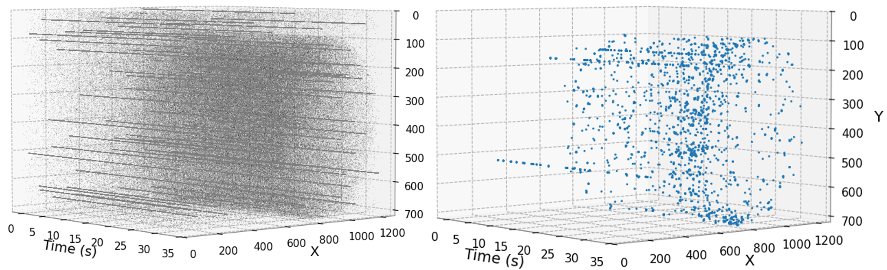
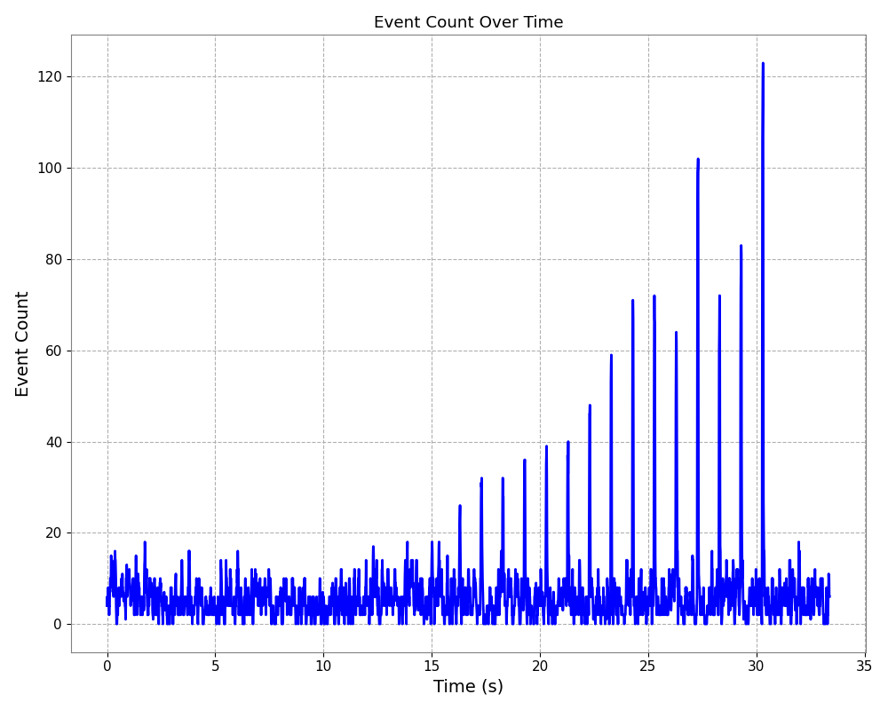

# eventNoiseFilter
This repository is designed to filter event noise by utilizing the presence of neighboring events. It provides tools for event-based camera data denoising, visualization, and analysis, tailored for researchers working with event-based camera.

#### Input & Output: The left panel shows raw event data (downsampled to 1/10), and the right panel shows denoised results.


#### Event Count: Event counts aggregated in 50 ms bins over time.


## Features
- Event Noise Filtering: Implements noise reduction techniques by evaluating the spatial and temporal proximity of events.
- Parameter Tuning: Allows fine-tuning of filtering parameters such as spatial and temporal thresholds to adapt to different datasets.
- Visualization Tools: Includes scripts for plotting raw, denoised, and aggregated event counts in customizable formats.

## Sample Data
The sample data used in this repository was obtained during an experiment conducted in collaboration with Professor Nishino from Hirosaki University.

## Project Structure
```bash
.
├── filter_events.cpp       # Handles event-based denoising in C++
├── plotAllData.py          # Plotting script for All events
├── plotFiltered.py          # Plotting script for denoised events
├── plotEventCount.py          # Plotting script for event count
├── setup.py                 #  Script for building the C++ code for particle tracking
├── eventFilter.py       # Denoising script
└── README.md                 # Project documentation (this file)
```

## Installation using PIP
1. Download and unpack the repository.
```bash
git clone https://github.com/yasuhitoHayashi/eventNoiseFiltering.git
cd eventNoiseFiltering
```
2. Install dependencies

Open a terminal and run below command:
```bash
pip install -r requirements.txt
```

## Modules Overview
### setup.py
Builds the C++ code using pybind11. This compiles the filter_events.cpp file into a Python module (particle_tracking).

```bash
python3 setup.py build_ext --inplace
```

### eventFilter.py
Processes CSV files generated from .RAW files, performs event denoising, and saves results in a pickle file for further analysis.

#### Arguments
- -i Path to the input csv file.

### plotAllData.py
Plots raw or subsampled event data in 3D.

#### Arguments
- -i Path to the input CSV file.
- -o Path to the output png file.
- -r sampling ratio.

### plotFiltered.py
Plots denoised event data in 3D from pickle files.

#### Arguments
- -i Path to the input pickle file.
- -o Path to the output png file.

### plotEventCount.py
Plots event counts aggregated in time bins from pickle files.

#### Arguments
- -i Path to the input pickle file.
- -b bin size.
- -o Path to the output png file.
